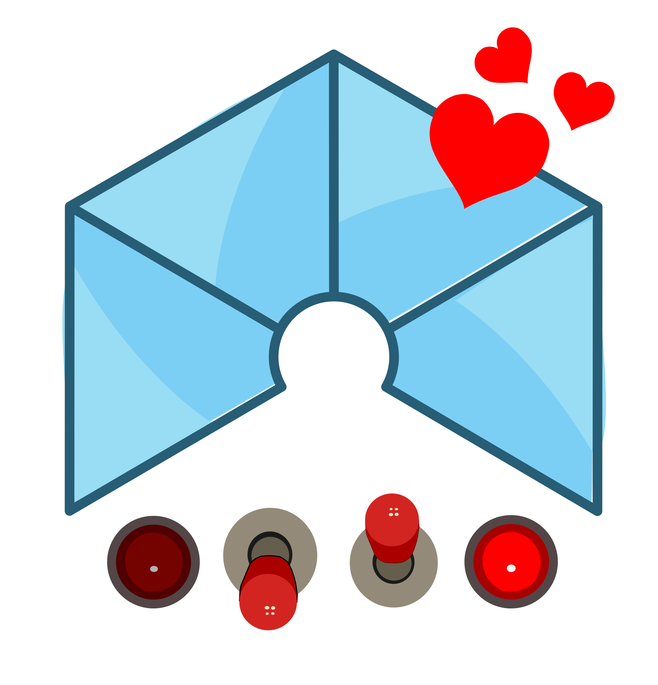

# LOVE-FPGA Collection

Library of virtual components

## Install

* Download the collection: [stable](https://github.com/FPGAwars/LOVE-FPGA-Collection/archive/v0.1.0.zip) or [development](https://github.com/FPGAwars/LOVE-FPGA-Collection/archive/master.zip)
* Install the collection: *Tools > Collections > Add*
* Load the collection: *Select > Collection*

## Blocks
* *Bus*
  * VIB-Input-Bus
  * VIB-Split
  * VIB-join
  * VOB-Output-Bus
  * VOB-Split
  * VOB-join
* *Inputs*
  * *Pushbuttonx1*
    * PushButtonx1-bus
    * PushButtonx1-rx
    * PushButtonx1
  * *Switchx1*
    * Switchx1-bus
    * Switchx1-rx
    * Switchx1
  * *Switchx2*
    * Switchx2-bus
    * Switchx2-rx
    * Switchx2
  * *Switchx4*
    * Switchx4-Bus
    * Switchx4-rx
    * Switchx4
* *Outputs*
  * *LEDx1*
    * LEDx1-BUS
    * LEDx1-tx
    * LEDx1
  * *LEDx2*
    * LEDx2-bus
    * LEDx2-tx
    * LEDx2
  * *LEDx4*
    * LEDx4-bus
    * LEDx4-tx
    * LEDx4
  * *LEDx8*
    * LEDx8-tx
    * LEDx8

## Examples
* 01-switch-LED
* 02-switchx2-LEDx2
* 03-switchx2-pushbtn-LEDx3
* 04-switchx2-pushbtnx2-LEDx4
* 05-Virtual-LED
* 06-Virtual-LED-blink
* 07-Virtual-LEDx2-counter
* 08-switchx4-pushbtnx4-LEDx8
* *Test*
  * 01-pushbutton-test

## Authors
* [Juan González-Gómez (Obijuan)](https://github.com/Obijuan)

## License

Licensed under [GPL-2.0](https://opensource.org/licenses/GPL-2.0).
